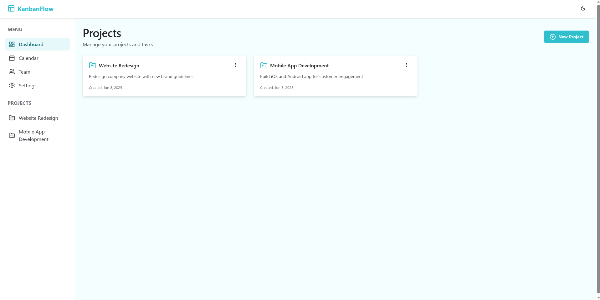
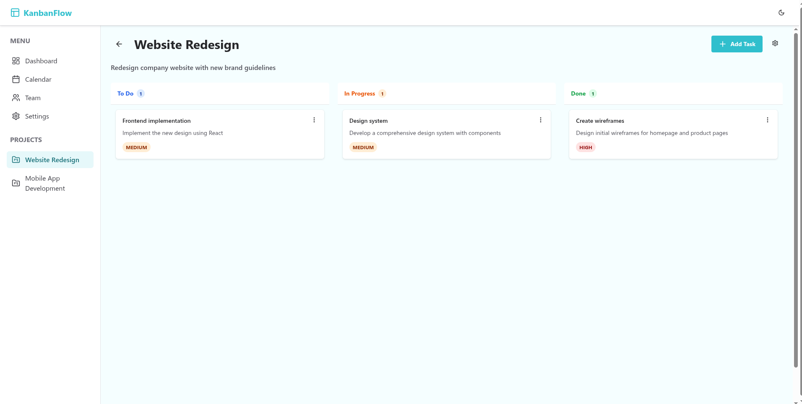
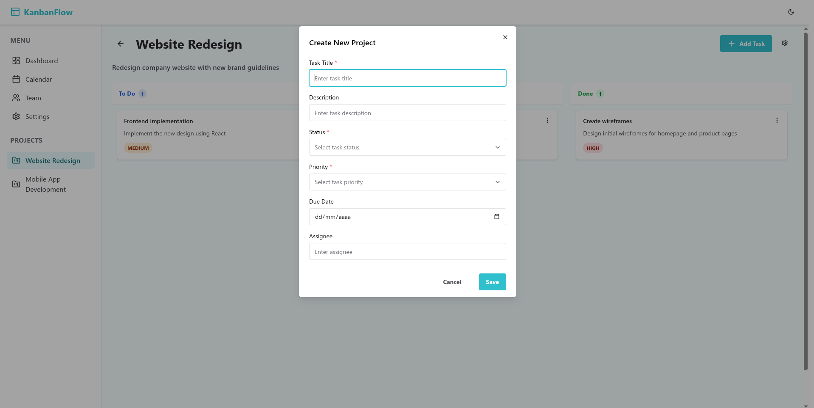

# Kanban Project Manager

Hi! I'm Marco, a front-end developer passionate about building intuitive and responsive web applications. This project is a personal initiative to showcase my practical skills in modern front-end development, with a focus on real-world features that recruiters and teams look for.

### 🧩 About the Project

**Kanban Project Manager** is a fully functional Kanban-style task management app. I built it from scratch using React, TypeScript, Zustand, and several modern libraries to manage drag-and-drop, state, theming, and form validation. It serves as both a technical challenge and a portfolio piece, demonstrating my ability to build modular, maintainable, and scalable front-end projects.

### Screenshots






### 🔍 Key Features

* Drag-and-drop task movement with smooth UX (`@dnd-kit/core`)
* Centralized and predictable state management (Zustand)
* Dynamic light/dark theme with `next-themes`
* Form validation with React Hook Form + Zod
* Styled UI components with Chakra UI
* Responsive and mobile-friendly design
* Routing with React Router v7
* Iconography with Lucide and React Icons

### 🛠️ Technologies I Used

* **React 19**, **TypeScript**, **Vite**
* **Zustand** for global state
* **@dnd-kit** for drag-and-drop logic
* **Chakra UI** + **Emotion** for styling
* **React Hook Form** + **Zod** for form management
* **next-themes** for theming
* **ESLint** for code quality

### 📦 How to Run It Locally

```bash
git clone https://github.com/Marco90v/kanban-project-manager.git
cd kanban-project-manager
npm install
npm run dev
```

Other commands:

```bash
npm run lint     # Code quality check
npm run build    # Production build
npm run preview  # Preview production build
```

### 📁 Project Structure

```
src/
├── components/      # Reusable UI components
├── pages/           # Pages and routing
├── types/           # Data types
├── store/           # Global state with Zustand
├── schema/          # Validation schemas
└── utils/           # Validation and helper functions
```

### 🎯 Why I Built This

I wanted to challenge myself with a realistic application that covers:

* UI design and accessibility
* App architecture with modular code
* Advanced interactions like drag-and-drop
* Type-safe and validated forms
* A complete build/lint/test/dev flow

My goal is to show that I can take an idea, design a structure, implement clean code, and deliver an end-to-end solution.

### 📬 Contact Me

* Portfolio: [marcovelasquezfigarella.netlify.app](https://marcovelasquezfigarella.netlify.app/)
* LinkedIn: [linkedin.com/in/marco90v](https://linkedin.com/in/marco90v)